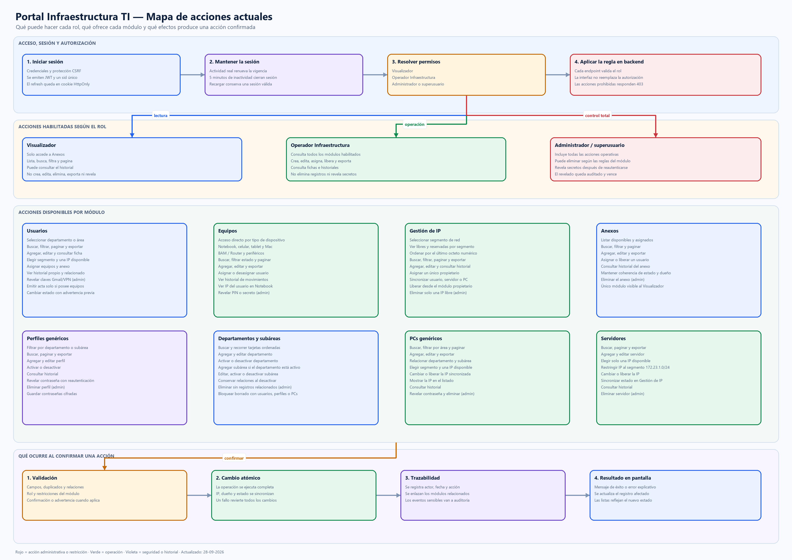

# Acciones actuales del Portal Infraestructura TI

Este documento resume las acciones implementadas actualmente en la interfaz y
las reglas que el backend vuelve a validar. El diagrama sirve como mapa de uso
del portal; no incluye funcionalidades futuras.

## Diagrama

[Abrir imagen PNG](diagramas/mapa_acciones_actuales.png) ·
[Abrir imagen SVG](diagramas/mapa_acciones_actuales.svg) ·
[Editar fuente Mermaid](diagramas/fuentes/mapa_acciones_actuales.mmd)

## Acciones según el rol

| Rol | Consulta | Crear/editar/asignar | Exportar | Eliminar | Revelar secretos |
| --- | --- | --- | --- | --- | --- |
| Visualizador | Solo Anexos: listado, búsqueda, filtros, paginación e historial | No | No | No | No |
| Operador Infraestructura | Todos los módulos habilitados | Sí | Sí | No | No |
| Administrador | Todos los módulos | Sí | Sí | Sí, según las reglas del módulo | Sí, tras reautenticación |
| Superusuario | Igual que Administrador | Sí | Sí | Sí, según las reglas del módulo | Sí, tras reautenticación |

La autorización se comprueba en el backend. Ocultar un botón en la interfaz
mejora la experiencia, pero no es el control de seguridad definitivo.

## Acciones por módulo

### Usuarios

- Seleccionar un departamento o área y consultar sus usuarios.
- Buscar, paginar y exportar el resultado.
- Agregar, editar, eliminar con permiso administrativo y abrir la ficha.
- Elegir primero el segmento de red y luego una IP disponible.
- Consultar IP, hostname, teléfono, anexo, equipos y credenciales asociados.
- Asignar equipos y anexo mediante sus módulos relacionados.
- Consultar el historial propio y los movimientos originados en otros módulos.
- Revelar las claves de Gmail o VPN como administrador, previa reautenticación.
- Generar el acta de entrega cuando existe al menos un equipo asignado. Si no
  existe esa relación, la interfaz lo explica y el backend responde `409`.
- Cambiar el estado con una advertencia previa: `LICENCIA` libera solamente la
  IP; `BAJA` libera la IP, desasigna equipos y libera el anexo.

### Equipos

- Entrar directamente a Notebook, Celular, Tablet, Mac, BAM / Router o
  Periféricos desde el menú lateral.
- Buscar, filtrar por estado, paginar y exportar.
- Agregar, editar, eliminar con permiso administrativo y consultar historial.
- Asignar o desasignar un usuario.
- Ver en Notebook la IP que pertenece al usuario asignado.
- Revelar PIN u otro secreto admitido como administrador, previa
  reautenticación.

### Gestión de IP

- Seleccionar un segmento y consultar sus direcciones libres o reservadas.
- Ordenar las direcciones por su último octeto numérico.
- Buscar, filtrar, paginar y exportar.
- Agregar, editar y consultar el historial de asignación.
- Mantener un único propietario: usuario, servidor, PC genérico u otro uso.
- Sincronizar automáticamente la dirección, el propietario y el estado.
- Liberar una IP desde el módulo que posee la asignación.
- Eliminar como administrador solo cuando la IP está libre.

### Anexos

- Listar, buscar, filtrar, paginar y exportar.
- Agregar, editar y eliminar con permiso administrativo.
- Asignar o liberar un usuario y mantener coherentes dueño y estado.
- Consultar el historial de movimientos.
- Permitir al Visualizador únicamente las acciones de consulta e historial.

### Perfiles genéricos

- Filtrar por departamento o subárea, buscar, paginar y exportar.
- Agregar, editar, activar, desactivar y consultar historial.
- Eliminar con permiso administrativo.
- Revelar la contraseña como administrador, previa reautenticación.

### Departamentos y subáreas

- Buscar y recorrer las tarjetas en orden.
- Agregar, editar, activar o desactivar departamentos.
- Agregar una subárea cuando el departamento está activo.
- Editar, activar o desactivar subáreas sin perder las relaciones existentes.
- Eliminar como administrador solo cuando no existen usuarios, perfiles, PCs
  genéricos ni subáreas relacionados, según el tipo de registro.

### PCs genéricos

- Buscar, filtrar por departamento, paginar y exportar.
- Agregar, editar y relacionar departamento o subárea.
- Elegir un segmento y luego una IP disponible.
- Mostrar la IP asignada y sincronizar sus cambios con Gestión de IP.
- Consultar historial, revelar contraseña como administrador y eliminar con
  permiso administrativo.

### Servidores

- Buscar, paginar y exportar.
- Agregar y editar seleccionando una IP disponible de `172.23.1.0/24`.
- Cambiar o liberar la IP y sincronizar su estado en Gestión de IP.
- Consultar historial y eliminar con permiso administrativo.

## Flujo común al confirmar

1. El backend valida la sesión, el rol, los campos, los duplicados y las
   relaciones requeridas.
2. Las operaciones relacionadas se aplican dentro de una transacción para que
   se confirmen juntas o se reviertan ante un fallo.
3. Las asignaciones actualizan el recurso, su propietario y su estado.
4. El historial registra actor, fecha, acción, valores anteriores y valores
   nuevos. Los eventos sensibles se registran además en la auditoría de
   seguridad.
5. La interfaz informa el resultado y actualiza los registros afectados.

Mapa contrastado con la implementación actual del repositorio al 28-09-2026.
