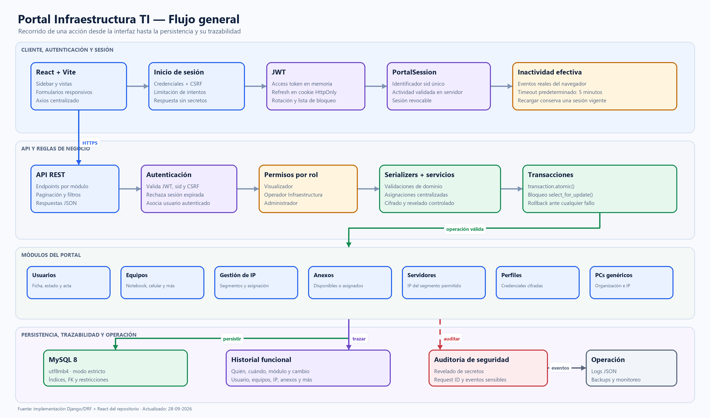
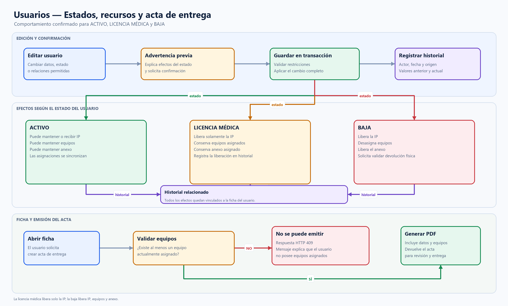

# Arquitectura y flujos del Portal Infraestructura TI

Este documento describe el comportamiento implementado. Los diagramas se
entregan en PNG para lectura directa, SVG para ampliar sin pérdida y Mermaid
para modificarlos en el futuro.

## 1. Flujo general

[Abrir imagen PNG](diagramas/flujo_sistema_general.png) ·
[Abrir imagen SVG](diagramas/flujo_sistema_general.svg) ·
[Editar fuente Mermaid](diagramas/fuentes/flujo_sistema_general.mmd)



El recorrido normal de una operación es:

1. React presenta la vista y envía la solicitud mediante el cliente Axios
   común.
2. Django valida CSRF cuando corresponde, el access token JWT, el identificador
   `sid` y la vigencia de `PortalSession`.
3. `PortalRolePermission` comprueba el rol y la acción solicitada.
4. El serializer y el servicio de dominio validan la operación.
5. Las asignaciones críticas se ejecutan dentro de `transaction.atomic()` y
   bloquean los registros necesarios con `select_for_update()`.
6. La base aplica también claves foráneas, valores únicos y restricciones
   `CHECK`.
7. El cambio funcional queda en su historial. Las operaciones sensibles, como
   revelar una contraseña, generan además un `SecurityAuditLog`.

### Autenticación y sesión

- El access token JWT vive en memoria del frontend.
- El refresh token se guarda en una cookie `HttpOnly`; JavaScript no puede
  leerlo.
- Cada inicio válido crea un `sid` único asociado a una `PortalSession`.
- El backend valida la actividad real y permite revocar una sesión concreta.
- El tiempo de inactividad predeterminado es 300 segundos. Recargar la página
  no cierra una sesión todavía vigente porque el frontend renueva el access
  token usando la cookie.
- Los refresh tokens rotan y los reemplazados pasan a la lista de bloqueo.

### Roles

| Rol | Alcance |
| --- | --- |
| Visualizador | Solo lectura en Anexos. |
| Operador Infraestructura | Lectura, creación, edición y asignación; no elimina ni revela secretos. |
| Administrador | Acceso completo y revelado de secretos después de reautenticarse. |
| Superusuario | Se trata como Administrador. |

## 2. Estados del usuario y recursos

[Abrir imagen PNG](diagramas/flujo_estados_usuario.png) ·
[Abrir imagen SVG](diagramas/flujo_estados_usuario.svg) ·
[Editar fuente Mermaid](diagramas/fuentes/flujo_estados_usuario.mmd)



Antes de guardar un cambio de estado, la interfaz explica sus consecuencias.
El backend vuelve a validar la operación y aplica todos sus efectos en una
transacción.

| Estado final | IP | Equipos | Anexo |
| --- | --- | --- | --- |
| `ACTIVO` | Puede mantener o recibir una IP. | Se mantienen; se pueden asignar. | Se mantiene; se puede asignar. |
| `LICENCIA` | Se libera. | Se mantienen asignados. | Se mantiene asignado. |
| `BAJA` | Se libera. | Se desasignan. | Se libera. |

Las liberaciones y asignaciones originadas en otros módulos se relacionan
también con el historial del usuario mediante `modulo_relacionado` y
`objeto_relacionado_id`. Así se puede reconstruir el movimiento desde la ficha
del usuario y desde el recurso afectado.

### Acta de entrega

El acta solo se puede emitir si existe al menos un equipo actualmente asignado
al usuario. La interfaz deshabilita la acción y explica el motivo; el endpoint
vuelve a comprobarlo y responde `409 Conflict` si alguien intenta omitir la
interfaz. Cuando la relación existe, el backend genera el PDF con los datos y
equipos vigentes.

## 3. Sincronización de IP

`AsignacionIP` representa al propietario formal y exclusivo de cada dirección.
Los campos directos presentes en `IP`, `Usuario`, `Servidor` y `PCGenerico` se
mantienen como proyecciones compatibles para las vistas existentes.

El servicio de asignación:

1. bloquea la IP y los propietarios involucrados;
2. comprueba que la dirección siga libre y pertenezca al segmento permitido;
3. reemplaza o libera la asignación anterior;
4. sincroniza las proyecciones directas;
5. registra `HistorialAsignacionIP` y el historial relacionado del usuario;
6. confirma todo junto o revierte todo ante un fallo.

Una IP puede tener exactamente uno de estos propietarios: usuario, servidor,
PC genérico u otro dispositivo/servicio descrito en texto.

## 4. Archivos reproducibles

- `diagramas/fuentes/generar_diagramas.py` genera los PNG y SVG sin consultar
  la base de datos.
- Los archivos `.mmd` contienen una versión editable en Mermaid.
- Para regenerar las imágenes:

```powershell
.\venv\Scripts\python.exe docs\diagramas\fuentes\generar_diagramas.py
```

El modelo físico y sus restricciones se documentan en
[MODELO_DATOS.md](MODELO_DATOS.md).
