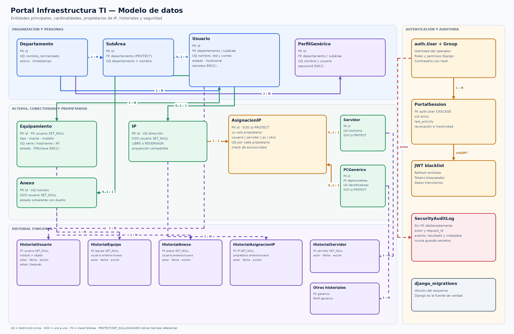

# Modelo de datos

La definición ejecutable del esquema vive en `core/models.py` y en las
migraciones de Django. Este documento sirve para comprenderla y preparar
MySQL; no reemplaza las migraciones ni debe convertirse manualmente en un
segundo esquema SQL.

[Abrir diagrama PNG](diagramas/modelo_datos_er.png) ·
[Abrir diagrama SVG](diagramas/modelo_datos_er.svg) ·
[Editar fuente Mermaid](diagramas/fuentes/modelo_datos_er.mmd)

## 1. Catálogo de entidades

| Grupo | Modelo | Responsabilidad principal |
| --- | --- | --- |
| Organización | `Departamento` | Catálogo normalizado de áreas. |
| Organización | `SubArea` | Subdivisión opcional perteneciente a un departamento. |
| Personas | `Usuario` | Persona, identidad de red, estado y credenciales corporativas cifradas. |
| Telefonía | `Anexo` | Número único y su asignación opcional a un usuario. |
| Activos | `Equipamiento` | Notebook, celular, tablet, Mac, BAM/router o periférico. |
| Cuentas | `PerfilGenerico` | Cuenta genérica asociada a la estructura organizacional. |
| Cuentas/equipos | `PCGenerico` | Cuenta local, equipo genérico e IP opcional. |
| Red | `IP` | Dirección única, estado y proyección del propietario. |
| Red | `AsignacionIP` | Propietario formal, único y vigente de una IP. |
| Red | `Servidor` | Servidor identificado por hostname e IP opcional. |
| Historial | `HistorialUsuario` | Cambios propios y eventos relacionados de otros módulos. |
| Historial | `HistorialAnexo` | Creación, edición, asignación, liberación y eliminación. |
| Historial | `HistorialEquipo` | Movimientos y cambio de usuario del equipo. |
| Historial | `HistorialAsignacionIP` | Propietarios anterior/nuevo y cambios de IP. |
| Historial | `HistorialServidor` | Ciclo de vida y cambios del servidor. |
| Historial | `HistorialPCGenerico` | Ciclo de vida y cambios del PC genérico. |
| Historial | `HistorialPerfilGenerico` | Ciclo de vida y cambios del perfil genérico. |
| Seguridad | `SecurityAuditLog` | Eventos sensibles, resultado, actor y request ID. |
| Sesión | `PortalSession` | Sesión lógica JWT, última actividad y revocación. |

Django agrega las tablas de `auth`, `contenttypes`, `sessions`,
`django_migrations` y la lista de bloqueo de Simple JWT.

## 2. Relaciones y borrado referencial

| Origen | Destino | Cardinalidad | Regla al borrar |
| --- | --- | --- | --- |
| Departamento | SubÁrea | 1:N | `PROTECT` |
| Departamento | Usuario | 1:N | `PROTECT` |
| Departamento | Perfil genérico | 1:N | `PROTECT` |
| Departamento | PC genérico | 1:N | `PROTECT` |
| SubÁrea | Usuario, perfil o PC | 1:N opcional | `PROTECT` |
| Usuario | Equipamiento | 1:N opcional | El equipo conserva su registro con `SET_NULL`. |
| Usuario | Anexo | 0..1:0..1 | El anexo queda disponible con `SET_NULL`. |
| Usuario | IP heredada/proyección | 0..1:0..1 | La IP se libera con `SET_NULL`. |
| Servidor | IP | 0..1:0..1 | `PROTECT` evita borrar una IP usada. |
| PC genérico | IP | 0..1:0..1 | `PROTECT` evita borrar una IP usada. |
| IP | Asignación IP | 1:0..1 | `PROTECT`; una IP con asignación formal no puede borrarse por ORM. |
| Propietario | Asignación IP | 0..1:0..1 | `CASCADE`; el servicio libera y registra antes de borrar. |
| Entidad | Su historial | 1:N opcional | El historial permanece con `SET_NULL`. |
| `auth.User` | PortalSession | 1:N | `CASCADE`. |

Los historiales conservan además textos descriptivos del elemento y del
usuario para que una eliminación autorizada no destruya el significado del
movimiento anterior.

## 3. Reglas que también aplica la base

Las validaciones del frontend mejoran la experiencia y las del serializer dan
mensajes útiles. La base mantiene las invariantes esenciales aunque una carga
concurrente alcance el último nivel.

### Unicidad normalizada

- Departamento: `nombre_normalizado`.
- SubÁrea: departamento + `nombre_normalizado`.
- Usuario: nombre completo, usuario de red y correo normalizados.
- Equipamiento: serie, activo fijo y hostname de computador cuando aplican.
- Perfil genérico: usuario normalizado.
- PC genérico: hostname, serie y activo fijo normalizados.
- Servidor: hostname normalizado.
- IP y anexo: dirección/número únicos.

La normalización elimina diferencias accidentales de mayúsculas, acentos y
espacios antes de guardar.

### Restricciones de coherencia

- `ck_anexo_asignacion_valida`: un anexo sin usuario está `DISPONIBLE`; con
  usuario está `ASIGNADO`.
- `ck_ip_estado_propietario`: una IP sin propietario está `LIBRE`; una IP con
  usuario u otro detalle está `RESERVADA`.
- `ck_equipo_asignacion_valida`: un equipo sin usuario no puede figurar como
  asignado ni conservar fecha de asignación.
- `ck_asignacion_ip_propietario_valido`: cada asignación tiene exactamente un
  propietario compatible con su tipo.
- Las relaciones uno a uno impiden que dos usuarios, servidores o PCs tengan
  simultáneamente la misma IP y que un propietario tenga dos IP activas.

### Índices operacionales

Los índices actuales cubren los filtros usados con mayor frecuencia:

- usuarios por estado y departamento;
- equipos por tipo/estado y usuario/tipo;
- IP por estado/dirección;
- anexos por estado/número;
- perfiles por estado/departamento;
- PCs por departamento/subárea;
- historiales por entidad y fecha descendente.

Antes de agregar otro índice se debe medir el endpoint y revisar su plan con
`EXPLAIN`, porque cada índice también encarece las escrituras.

## 4. Datos sensibles

Los siguientes campos se cifran en la aplicación con Fernet y el prefijo
`ENC2::`:

- contraseña Gmail y VPN del usuario;
- PIN y contraseña iCloud del equipo;
- contraseña del perfil genérico;
- contraseña del PC genérico.

`FIELD_ENCRYPTION_KEY` no se almacena en la base ni en Git. Debe respaldarse por
separado. Las contraseñas de los operadores de Django se guardan como hashes no
reversibles. Los historiales y `SecurityAuditLog` no deben recibir secretos,
tokens ni claves en texto legible.

## 5. Decisiones para MySQL

- Motor: MySQL 8.
- Juego de caracteres: `utf8mb4`.
- Intercalación del contenedor: `utf8mb4_unicode_ci`.
- Modo SQL: `STRICT_TRANS_TABLES`.
- Aislamiento: `READ COMMITTED`.
- Conexiones persistentes con comprobación de salud.
- Django migrations continúa siendo la única fuente de verdad del esquema.

El procedimiento de carga y validación está en
[MIGRACION_MYSQL.md](MIGRACION_MYSQL.md).
